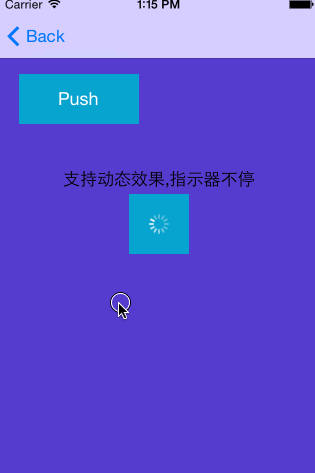

UINavigationController-YRBackGesture
====================================

Custom slide to right gesture to show previous view controller , similar to iOS7 back gesture but work not only at left edge

####简单介绍
iOS7之后，支持右滑返回手势，但是默认的右滑手势只能在左边线工作，且只能iOS7以上。  

而目前很多APP的右滑返回都可以支持几乎全屏的操作，更加简单，比如网易新闻APP。

这里我做了个Category，`带视差效果`，`支持iOS4以上系统`  
使用方式非常简单：  
1. 导入头文件  
2. 对NavigationController调用开启方法：  

		[navi setEnableBackGesture:true];

具体效果可以看demo和底下的效果动画。

######PS
这种右滑手势，目前网上有另外一种解决方案，采用Push前截屏保存页面快照的方式实现，缺点是如果前一个页面有动态效果则不能正常展现。个人不是很喜欢，毕竟有些前一个页面的动态效果可能还是需要在滑动过程中展现。  
而本Category基于navi中的各个VC的view调用处理，能很好的展现前一个页面的动画，指示器等等。
当然缺点也有：不支持顶部的NavigationBar一起移动，不过个人一直都是使用自定义的顶部导航，因此无此问题。

希望能对大家有所帮助。

